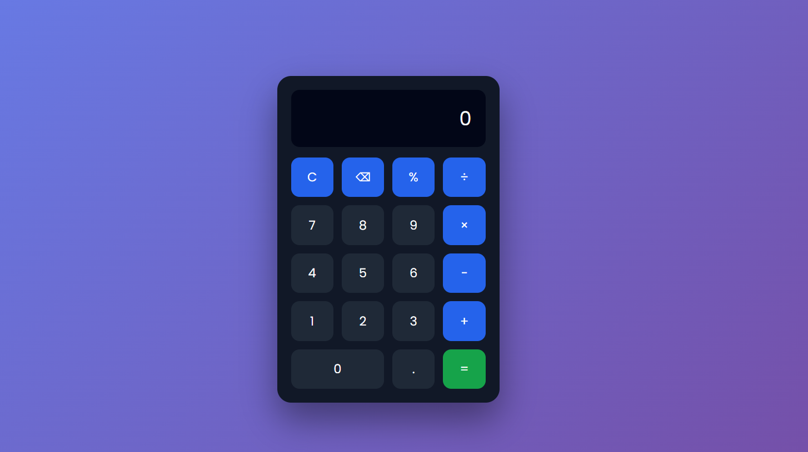

# 🧮 Calculator Web Application


A modern and interactive **Calculator Web Application** built using **HTML, CSS, and JavaScript**.  
It performs basic arithmetic operations with a clean UI, smooth animations, and proper error handling.

---

## 🔗 Live Demo

[](https://your-live-demo-link-here)

> 👉 Replace `your-live-demo-link-here` with your Vercel / GitHub Pages URL

---

## 📸 Screenshots

### 🧮 Calculator Interface


> 📁 Create a `screenshots/` folder and add your calculator screenshot.

---

## ✨ Features

- ➕ Addition  
- ➖ Subtraction  
- ✖️ Multiplication  
- ➗ Division  
- 🔄 Clear (Reset) functionality  
- ⌫ Delete last input  
- ⚠️ Error handling for invalid expressions  
- 🎨 Modern UI with hover effects and animations  

---

## 🛠️ Tech Stack

- **HTML5** – Structure  
- **CSS3** – Styling, layout, animations  
- **JavaScript (ES6)** – Logic and event handling  

---

## 📂 Project Structure

calculator/
├── index.html
├── style.css
├── script.js
└── screenshots/
└── calculator-ui.png


---

## ⚙️ Setup & Usage

1. Clone the repository
   ```bash
   git clone https://github.com/Varun2146/calculator-app.git
   
Open the project folder

Open index.html in your browser

No additional dependencies required 🚀

📚 What I Learned

Implementing calculator logic using JavaScript

Handling user input and events

Using CSS Grid for layout design

Creating interactive UI with hover effects

Implementing basic error handling in JavaScript

🚀 Future Enhancements

⌨️ Keyboard input support

🌙 Dark mode

📱 Improved mobile responsiveness

🧠 Scientific calculator functions

🤝 Contributing

Contributions are welcome!
Feel free to fork this repository and submit a pull request.

📄 License

This project is licensed under the MIT License.

⭐ Show Some Love

If you like this project:

⭐ Star the repository

🍴 Fork it

🔗 Share it with others

👤 Author

Varun
Web Development Intern | Frontend Developer

